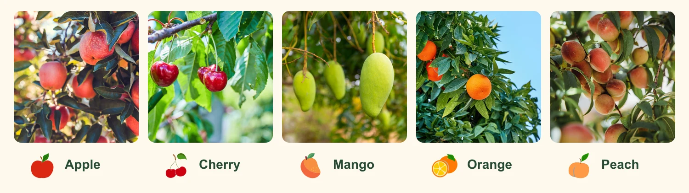

# Leaf It to Me

[English](README.md) | 한국어



**사과·체리·망고·오렌지·복숭아나무의 잎 사진으로 나무 종류와 잎의 상태를
분류하는 Python 실험 프로젝트**입니다. 가벼운 이미지 분류 모델인 MobileNetV4를
PyTorch와 timm으로 학습합니다.

터미널에서 정답 라벨이 있는 잎 사진을 내려받고, 데이터를 준비하고, 모델을 학습한 뒤
직접 찍은 사진으로 예측해 볼 수 있습니다. 패키지 명령어는
`python -m leafit` 형식으로 실행합니다.

## 분류할 수 있는 과수와 잎 상태

모델은 과수 종류와 잎 상태를 조합한 18개 항목(클래스) 중 하나를 선택합니다.
데이터셋의 분류 항목과 대조할 수 있도록 주요 병해충 이름은 영어를 함께 표기했습니다.

<table>
  <thead>
    <tr><th width="100">과수</th><th>잎 상태</th></tr>
  </thead>
  <tbody>
    <tr><td nowrap><strong>사과</strong></td><td>정상, 검은별무늬병(scab), 검은썩음병(black rot), 붉은별무늬병(cedar apple rust), 복합 병해(multiple diseases)</td></tr>
    <tr><td nowrap><strong>체리</strong></td><td>정상, 흰가루병(powdery mildew)</td></tr>
    <tr><td nowrap><strong>망고</strong></td><td>정상, 탄저병(anthracnose), 세균성 궤양병(bacterial canker), 잎을 자르는 바구미 피해(cutting weevil), 가지마름병(dieback), 혹파리 피해(gall midge), 흰가루병(powdery mildew), 그을음병(sooty mould)</td></tr>
    <tr><td nowrap><strong>오렌지</strong></td><td>감귤 황룡병(citrus greening)만 포함 (정상 오렌지 잎 클래스 없음)</td></tr>
    <tr><td nowrap><strong>복숭아</strong></td><td>정상, 세균구멍병(bacterial spot)</td></tr>
  </tbody>
</table>

예측 결과에는 나무 종류, 잎 상태, 둘을 조합한 라벨, 모델 점수가 담깁니다.
아래는 **출력 형식을 보여 주는 예시이며, 실제 측정 결과가 아닙니다.**

```json
{
  "tree_type": "Apple",
  "condition": "scab",
  "class_label": "apple_scab",
  "model_score": 0.73
}
```

이 점수는 모델이 알고 있는 라벨 중 해당 라벨을 얼마나 선호하는지 나타냅니다.
진단이 맞을 확률이 73%라는 뜻은 아닙니다. 학습을 위한 실험이므로 결과를 해석하기 전에
[한계](#한계)를 확인하세요.

## 1. 실행 환경 준비

[uv](https://docs.astral.sh/uv/getting-started/installation/)를 설치한 뒤,
`pyproject.toml`이 있는 프로젝트 폴더에서 터미널을 엽니다. 아래 명령어는 모두
그 폴더에서 실행합니다. 예시는 Bash 또는 Zsh 기준이며, Windows에서는 WSL을 사용합니다.
초기 설치와 다운로드에는 인터넷 연결이 필요합니다. GPU는 없어도 됩니다.

```bash
uv sync --locked
cp -n .env.example .env
```

`uv`는 Python 3.12.12 환경과 버전이 고정된 의존성을 `.venv`에 설치합니다.
복사 명령어는 기존 `.env`를 덮어쓰지 않고 새 파일이 필요할 때만 만듭니다.
개인 설정 파일인 `.env`에서 다음 값을 수정하세요.

| 설정 | 값 |
|---|---|
| `LEAFIT_DATA` | `data/raw`와 `data/prepared`를 둘 상위 폴더입니다. 프로젝트 폴더를 쓰려면 `"."`, 다른 저장 공간을 쓰려면 해당 경로를 입력합니다. |
| `LEAFIT_IMAGE` | 학습 후 예측할 사진 경로입니다. 예: `"./data/my-leaf.jpg"`. |

경로는 따옴표로 감쌉니다. 새 터미널을 열거나 설정을 바꾼 뒤에는 다음 명령어로 불러옵니다.

```bash
set -a
source .env
set +a
```

이렇게 하면 Python과 `"$LEAFIT_DATA"` 같은 셸 표현식에서 설정값을 사용할 수 있습니다.
외장 저장 장치에 데이터를 두었다면 사용하는 동안 연결을 유지하세요.

## 2. 설치 확인

데이터셋을 내려받기 전에 작은 테스트를 실행합니다.

```bash
uv run python -m leafit smoke --no-pretrained --device cpu --output runs/quick-check
```

이 테스트는 합성 이미지를 만들어 데이터 준비, 학습, 저장, 불러오기, 예측이 이어지는지
확인합니다. 의존성을 설치한 뒤에는 추가 다운로드가 필요하지 않습니다.
이때 나오는 점수는 실제 잎을 분류하는 성능을 뜻하지 않습니다.
다시 실행할 때는 새 출력 폴더를 사용하세요.

## 3. 데이터셋 다운로드

세 가지 데이터셋을 사용합니다. 아래 수치는 읽을 수 없는 이미지나 관련 복제본을
걸러내기 전, 원본 배포본에서 선택한 이미지 수입니다.

| 데이터셋 | 사용하는 과수 잎 | 선택한 이미지 수 | 이용 조건 |
|---|---|---:|---|
| [PlantVillage](https://huggingface.co/datasets/mohanty/PlantVillage) | 사과·체리·복숭아·오렌지 잎의 원본 컬러 이미지, 9개 분류 항목 | 13,241 | CC BY-SA 3.0 |
| [Plant Pathology 2020 / FGVC7 (Cornell)](https://www.kaggle.com/competitions/plant-pathology-2020-fgvc7/data) | 공개된 `train.csv` 라벨이 있는 사과 잎 | 1,821 | Apache 2.0 및 [대회 규정](https://www.kaggle.com/competitions/plant-pathology-2020-fgvc7/rules). 대회 규정이 우선합니다. |
| [MangoLeafBD v1](https://data.mendeley.com/datasets/hxsnvwty3r/1) | 제공된 증강 이미지를 포함한 망고 잎, 8개 분류 항목 | 4,000 | CC BY-NC 3.0 |

아래 안내에 따라 원본 배포본을 내려받습니다.
[데이터 출처 안내](docs/SOURCES.md)에는 저자 정보, 사용 버전(고정 리비전), 수동 다운로드 방법이 있습니다.
링크된 세부 기술 문서는 영어로 제공됩니다.

`.env`를 불러온 상태에서 저장 폴더를 만들고 PlantVillage를 내려받습니다.

```bash
mkdir -p "$LEAFIT_DATA/data/raw" "$LEAFIT_DATA/downloads"
uv run python -m leafit download-plantvillage --output "$LEAFIT_DATA/data/raw/plantvillage"
```

Cornell 데이터는 대회 페이지에 로그인하고 규정에 동의한 뒤
`plant-pathology-2020-fgvc7.zip`을 내려받습니다.
`LEAFIT_DATA` 아래의 `downloads` 폴더에 저장하고, 라벨이 있는 사진을 가져옵니다.

```bash
uv run python scripts/import_cornell_zip.py \
  --archive "$LEAFIT_DATA/downloads/plant-pathology-2020-fgvc7.zip" \
  --output "$LEAFIT_DATA/data/raw/cornell"
```

가져오기 도구는 라벨이 없는 대회 테스트 사진을 제외하고 ZIP 파일은 보관합니다.
검증 후 ZIP 파일도 삭제하려면 `--delete-archive`를 추가하세요.

MangoLeafBD를 내려받습니다.

```bash
uv run python scripts/download_mangoleafbd.py --output "$LEAFIT_DATA/data/raw/mangoleafbd"
```

이 스크립트는 압축을 푼 파일을 검증한 뒤 임시 ZIP 파일을 삭제합니다.
다운로드가 차단되면 [데이터 출처 안내](docs/SOURCES.md)의 수동 가져오기 방법을 사용하세요.

## 4. 데이터 준비와 학습

세 데이터셋을 합쳐 사진 목록과 라벨 매핑을 만듭니다.

```bash
uv run python merge_datasets.py
```

스크립트는 이미지를 확인하고, 탐지한 복제본을 묶은 뒤
`"$LEAFIT_DATA/data/prepared"` 아래에 `manifest.csv`, `labels.json`, 검토 보고서를 저장합니다.
원본 사진은 그대로 둡니다.

데이터 준비 단계에서는 최종적으로 남긴 이미지 수와 클래스별 분포를 보고합니다.
동일한 이미지에 서로 다른 라벨이 붙은 복제본은 제외합니다.
망고 데이터는 탐지된 관련 이미지 묶음과 클래스별로 대표 이미지 한 장만 남깁니다.
같은 묶음을 여러 세트에 나누지 않고, 다음 비율을 목표로 분할합니다.

| 구분 | 목표 비율 | 용도 |
|---|---:|---|
| 학습(Training) | 약 80% | 모델 학습 |
| 검증(Validation) | 약 10% | 저장된 모델 중 최적 모델 선택 |
| 테스트(Test) | 약 10% | 선택한 모델의 성능 평가 |

묶음의 크기와 필터링 결과에 따라 실제 이미지 수는 달라집니다.
학습 전에 `report.json`에서 클래스별 포함 현황과 묶음 처리의 한계를 확인하세요.
파일 형식은 [데이터셋 스키마](docs/DATASET_SCHEMA.md), 데이터 선별 방법은
[망고 이미지 묶음 안내](docs/MANGO_AUDIT.md)에 설명되어 있습니다.

먼저 실제 데이터의 일부 배치로 학습 과정을 확인합니다.

```bash
uv run python train.py --smoke
```

이 명령어는 학습 업데이트를 두 번 수행하고, 전체 검증·테스트 세트를 평가합니다.
정상적으로 끝나면 전체 학습을 실행합니다.

```bash
uv run python train.py
```

학습은 timm에서 제공하는 ImageNet-1k 사전 학습 체크포인트로 시작합니다.
먼저 마지막 분류층을 **2에포크(epoch)** 동안 학습하고, 이어서 모델 전체를 3에포크 동안
미세 조정합니다. 1에포크는 학습 사진 전체를 한 번씩 학습하는 단위입니다.

짧은 학습 확인 결과는 `runs/training-smoke`, 전체 학습 결과는 `runs/weekend`에 저장됩니다.
각 실행에는 새 폴더나 빈 출력 폴더가 필요합니다. 메모리 사용량을 줄여 다시 학습하려면
다음과 같이 실행합니다.

```bash
uv run python train.py --output runs/second-try --batch-size 8
```

학습 장치는 CUDA, Apple Silicon의 MPS, CPU 순으로 선택합니다.
CPU를 지정하려면 `--device cpu`를 사용하세요.
전체 설정은 [학습 안내](docs/TRAINING.md)에 있습니다.
`--data-root`를 지정하면 `LEAFIT_DATA`보다 우선 적용됩니다.

## 5. 예측과 결과 확인

`.env`의 `LEAFIT_IMAGE`에 잎 사진 경로를 입력하고 설정을 다시 불러옵니다.
저장된 모델로 예측합니다.

```bash
uv run python -m leafit predict --checkpoint runs/weekend/best.pt --image "$LEAFIT_IMAGE"
```

저장된 학습 결과를 보고서와 학습 곡선 그래프로 정리하려면 다음 명령어를 실행합니다.

```bash
uv run python scripts/summarize_training.py --run runs/weekend
```

`runs/weekend/results.md`를 엽니다. 기존 결과를 정리하는 작업이므로 다시 학습하지 않습니다.
함께 확인할 주요 파일은 다음과 같습니다.

| 파일 | 내용 |
|---|---|
| `best.pt` | 검증 결과로 선택한 모델, 라벨, 전처리 정보 |
| `metrics.json` | 정확도와 매크로 F1을 포함한 테스트 점수 |
| `per_class.csv` | 과수·잎 상태 조합별 결과 |
| `confusion_matrix.png` | 모델이 어떤 라벨을 서로 혼동하는지 보여 주는 행렬 |
| `history.json` | 학습 진행에 따른 학습·검증 결과 |

<strong>정확도(Accuracy)</strong>는 전체 예측 중 맞힌 비율입니다.
<strong>매크로 F1(Macro F1)</strong>은 놓친 사례와 잘못 예측한 사례를 함께 반영한 F1 점수를
클래스마다 같은 비중으로 평균한 값입니다.

저장된 모델을 다시 평가하려면 다음 명령어를 사용합니다.

```bash
uv run python -m leafit evaluate --checkpoint runs/weekend/best.pt \
  --manifest "$LEAFIT_DATA/data/prepared/manifest.csv" --output runs/evaluation
```

데이터셋을 다른 위치로 옮겼다면 `.env`를 수정하고 설정을 다시 불러온 뒤,
`merge_datasets.py`로 이미지 목록을 다시 만들어야 합니다.
목록에는 사진의 절대 경로가 저장되기 때문입니다.
예측만 할 때는 저장된 모델과 예측할 사진만 있으면 됩니다.

## 첫 전체 학습 결과

2026년 9월 12일, 다섯 종류의 과수에 해당하는 18개 라벨을 모두 사용해 학습을 마쳤습니다.
데이터는 **학습 14,929장**, **검증 1,867장**, **테스트 1,866장**으로 나뉘었습니다.

| 단계 | 에포크 수 | 학습률 |
|---|---:|---:|
| 특징 추출부(백본)는 고정하고 분류층만 학습 | 2 | 0.001 |
| 모델 전체 미세 조정 | 3 | 0.0001 |

설정: ImageNet으로 사전 학습된 `mobilenetv4_conv_small.e2400_r224_in1k`,
**224 × 224 RGB** 입력, **배치 크기 16**, AdamW와 **가중치 감쇠 0.0001**,
난수 시드 **42**, **MPS** 백엔드. 모든 학습 배치를 사용했습니다.

검증 결과로 **전체 학습의 4번째 에포크** 모델을 선택했습니다. 미세 조정 단계에 해당하며,
검증 매크로 F1은 **0.9201**이었습니다.
이 체크포인트는 18개 라벨 전체에서 **테스트 정확도 97.96%**
(1,866장 중 1,828장 정답), **테스트 매크로 F1 0.9417**을 기록했습니다.

수치는 저장된 `runs/weekend` 보고서에서 가져왔습니다.
준비된 데이터 분할에서 얻은 결과이며, 아래의 망고 이미지 묶음 처리 한계가 여전히 적용됩니다.
원본 보고서, 데이터셋, 모델 가중치는 Git에서 제외합니다.

## 한계

- 모델은 처음 보는 나무나 잎이 아닌 사진에도 알고 있는 라벨 중 하나를 선택합니다.
  '알 수 없음' 클래스는 없습니다.
- 오렌지 데이터에는 감귤 황룡병 사례만 있어 정상 오렌지 잎을 인식하도록 학습할 수 없습니다.
- 망고 이미지 묶음은 시각적 유사성과 카메라 메타데이터를 기준으로 만듭니다.
  관련 사진이 서로 다른 세트에 남아 테스트 성능이 실제보다 높게 나올 수 있습니다.
- 이 데이터셋의 점수가 새로운 정원이나 과수원에서도 같은 성능을 보장하지는 않습니다.
  모델 점수만으로 진단을 확정할 수 없습니다.

## 라이선스와 공개 범위

개인 학습 프로젝트로, 직접 작성한 코드와 문서를 [MIT](LICENSE) 라이선스로 공개합니다.
학습에 사용하는 데이터셋과 사전 학습 가중치에는 각각의 이용 조건이 적용됩니다.
README 배너의 사진과 아이콘은 유료 스톡 이미지 구독을 통해 이용 허락을 받은 자료이며,
배너에는 이 저장소의 MIT 라이선스가 적용되지 않습니다.
예측 결과를 시연하는 것과 해당 자료를 배포하는 것은 별개의 사용 행위입니다.
시연에 원본 이미지를 보여 준다면 그 이미지의 이용 조건을 따라야 합니다.
[출처별 라이선스 안내](docs/SOURCES.md#license-scope-and-attribution)와
[timm의 ImageNet 관련 유의사항](docs/SOURCES.md#pretrained-model-and-dependencies)을 확인하세요.

데이터셋, 모델 가중치, 개인 설정, 원본 실행 결과는 [`.gitignore`](.gitignore)로 제외해
로컬에 보관합니다. Git에 포함할 파일은 [저장소 안내](docs/REPOSITORY.md)에 정리되어 있습니다.

## 개발

`merge_datasets.py`와 `train.py`부터 살펴보세요.
`leafit/` 패키지는 데이터 준비, 학습, 평가, 예측을 담당하고,
`scripts/`에는 데이터 가져오기 도구와 결과 요약 스크립트가 있습니다.
자동화된 검사는 다음 명령어로 실행합니다.

```bash
uv run python -m unittest discover -s tests -v
```

검사 내용과 실행 방법은 [검증 안내](docs/VALIDATION.md)에 설명되어 있습니다.
